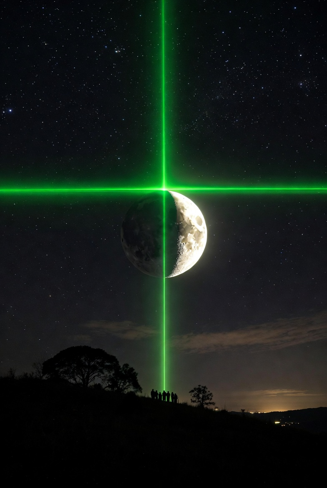

# Lunar Laser Cross Project  



**Projecting a Visible Emerald-Green Cross from the Moon's Northern Pole — Visible Across the Entire Contiguous United States**

## A Cathedral on the Moon

For as long as we have existed, humanity has looked up at the Moon and dreamed. Every civilization, every culture, every solitary soul on a dark night has felt the pull of that pale light. Now imagine changing what they see.

Standing anywhere in the continental United States on a clear night, you look up at the full Moon. And there — unmistakable, luminous, impossible to ignore — a brilliant **emerald-green cross** burns above the lunar disk. Not a projection on a building. Not a screen. A real structure, 384,400 kilometers away, painting the sky with coherent light.

The **Lunar Laser Cross Project** proposes building a cathedral on the Moon's northern pole — not a cathedral of worship, but of engineering. Inside it: a kilowatt-class laser and meter-scale optics that project a cross-shaped beam across the Earth–Moon divide, blanketing all 48 contiguous states in a single, shared, naked-eye spectacle.

One beam. One Moon. 330 million people looking up at the same light.

This is not science fiction. Every component — the laser, the optics, the power system, the launch vehicle — exists today or is in active development. What's missing is the will to build something this audacious.

## Project Overview

- **Location**: Cathedral + laser installation on the Moon's **northern pole** (visible northern limb from Earth).  
- **Target**: Contiguous United States (lower 48 states).  
- **Pattern**: Emerald-green cross (~0.7° total angular span) originating exactly at the northern limb of the Moon.  
- **Visibility**: Simultaneous, identical view from Maine to California and Minnesota to Texas whenever the Moon is up at night.  
- **Core technology**: Kilowatt-class fiber laser + large-aperture beam-shaping optics.  
- **Visualization tool**: The Python/Matplotlib script renders a scientifically accurate sky diagram at exact naked-eye angular scales.

## Setup & Running

Requires [uv](https://github.com/astral-sh/uv).

```bash
# Create virtual environment and install dependencies
uv venv
uv pip install -r requirements.txt

# Run the visualization (saves PNG to current directory)
uv run lunar-cross-visualization.py
```

The script produces `lunar_cross_scientific_visualization_proper_cross.png` in the working directory and opens an interactive plot window.

## Scientifically Accurate Visualization


The included Python script generates a calibrated angular sky diagram. All sizes are **exactly** as they would appear to the naked eye or a 50 mm camera lens — the Moon at 0.5°, the cross at 0.7°, arm thickness at 0.05°, all in true angular proportion.

## Scientific Basis & Math

### Geometry (exact angular scales)
- Average Earth–Moon distance: **d = 384 400 km = 3.844 × 10⁸ m**  
- Contiguous US east–west span ≈ 4 500 km → angular width θ_US = (4500 / 384400) × (180/π) ≈ **0.67°**  
- We size the cross to **0.7° total span** (comfortable margin).  

Moon apparent diameter from Earth = **0.5°** (exactly reproduced in the visualization).

Cross centered at lunar northern limb (top edge of the Moon's disk).

### Power requirement (radiometry)
The laser must deliver enough irradiance *E* at Earth so the cross is clearly visible to the naked eye (roughly magnitude 0 brightness level).

- Required irradiance at Earth (green 555 nm, peak eye sensitivity): **E ≈ 1 × 10⁻⁹ W/m²** (bright, unmistakable against night sky).  
- Solid angle of the cross-shaped pattern Ω:  
  Arms ≈ 0.7° long × 0.05° thick → Ω_horiz ≈ 1.06 × 10⁻⁵ sr, Ω_vert ≈ 1.06 × 10⁻⁵ sr  
  Total (minus tiny overlap) **Ω ≈ 2.05 × 10⁻⁵ steradians**.

**Optical power formula** (vacuum propagation, inverse-square law):  
**P_opt = E × Ω × d²**

```math
d² ≈ 1.477 × 10^{17} m²
P_opt ≈ (1 × 10^{-9}) × (2.05 × 10^{-5}) × (1.477 × 10^{17}) ≈ 3–5 kW optical
```

(Exact value depends on exact arm thickness; 3 kW gives a bright, clean cross; 5 kW adds extra margin.)

Wall-plug efficiency of modern fiber lasers ≈ 30–40 % → **electrical power ≈ 8–15 kW**.

## Engineering Challenges & Technology

### Key challenges
1. **Pointing & tracking** — Must keep the 0.7° beam centered on the US while the Moon orbits and Earth rotates. Tolerance is generous (~0.1–0.2°); simple ephemeris-driven actuators suffice.  
2. **Vacuum beam propagation** — No atmospheric scattering on the Moon side; the beam is invisible until it hits Earth's atmosphere (produces the visible glow). Diffraction controlled by large aperture optics (meters-scale).  
3. **Power & thermal management** — Lunar night = 14 Earth days of darkness → solar arrays + batteries **or** small radioisotope thermoelectric generator (RTG)/nuclear reactor. Radiative cooling only in vacuum.  
4. **Launch mass & construction** — Laser + optics + power system estimated 1–10 tonnes (space-qualified fiber lasers are compact). Cathedral structure can use **in-situ resource utilization (ISRU)** — lunar regolith sintered into concrete/glass via 3D printing (NASA Artemis program tech).  
5. **Safety** — Beam irradiance at Earth is eye-safe for diffuse viewing; avoid aircraft corridors via NOTAMs and precise aiming.

### Technology stack (current or near-future)
- **Laser**: Multi-kW continuous-wave fiber laser (IPG Photonics, nLIGHT, or equivalent — already commercially available).  
- **Beam shaper**: Diffractive optical element (DOE) or adaptive optics telescope to create the exact cross far-field pattern.  
- **Power**: High-efficiency solar arrays (≥30 % efficient, ~1.36 kW/m² at Moon) + Li-ion or flow batteries; fallback RTG (NASA MMRTG heritage).  
- **Optics & structure**: Lightweight carbon-composite or regolith-derived mirror/telescope.  
- **Pointing**: Reaction wheels + star trackers + laser comms heritage (e.g., NASA's Orion or Artemis systems).

## Sourcing, Mass & Power Estimates

- **Laser + optics mass**: ~500–2000 kg (modern industrial kW lasers weigh <200 kg; space-qualified versions are lighter).  
- **Power system**: 50–100 m² solar array (produces 15–30 kW peak) + battery storage ≈ 2–5 tonnes total.  
- **Cathedral**: Regolith-based construction (mass mostly local material). Only the laser payload is launched from Earth.  
- **Launch**: Starship-class vehicle (SpaceX) can deliver tens of tonnes to the lunar surface at dramatically lower cost than past missions.

**Total Earth-launched mass for laser system**: conservatively **<10 tonnes** — well within current heavy-lift capability.

## Why Build It?

Because some things deserve to exist simply for the awe they inspire.

The Lunar Laser Cross would be the first human-made structure visible from Earth with the naked eye beyond low orbit. It would be proof — silent, luminous, undeniable — that we are a species capable of reaching beyond our world and leaving a mark of beauty on another.

Every child who looks up and sees it will know: *we built that.* Every scientist, artist, and dreamer will know it too. Not a flag planted in dust and forgotten. A light that shines back, night after night, for generations.

The engineering is feasible. The physics is settled. The question is no longer *can we* — it is *will we*.

## References & Further Reading

- NASA Lunar Fact Sheet: https://nssdc.gsfc.nasa.gov/planetary/factsheet/moonfact.html  
- Continental US dimensions: USGS / Wikipedia "Geography of the United States"  
- High-power fiber lasers: IPG Photonics product literature (multi-kW CW systems)  
- Lunar ISRU & regolith sintering: NASA Artemis program documents & "Lunar Resources" papers  
- Laser beam propagation & radiometry: standard radiometry textbooks (e.g., "Radiometry and the Detection of Optical Radiation" by R. W. Boyd)  
- Night-sky visibility thresholds: amateur astronomy references & laser-show safety standards (ANSI Z136.6)
